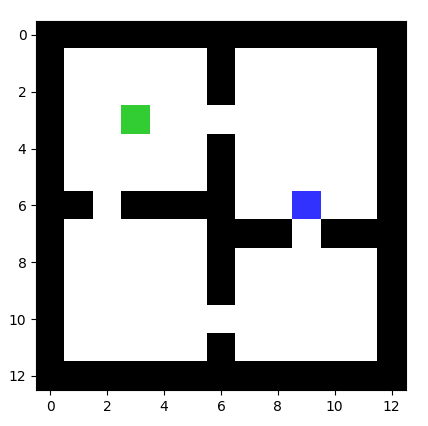

# PixelWorld

Gridworld environment made for navigation purposes. Check in the Description section for a detailed overview. 

---
## Installation
To install, do
```
git clone https://github.com/bmazoure/pixel_world.git
cd pixel_world
pip install -e .
```

---
## Description

The repo is structured as follows:
```
maps/
 |- room1.txt
pixel_world/
 envs/
 |-init.py
 |-env_utils.py
```

The environment can build arbitrary defined maps. For example, *room5_medium.txt* is defined as
```
###########
#        0#
####   ####
#         #
#S        #
###########
```




The environment has four actions: {**↑**,**→**,**↓**,**←**} corresponding to integers from 0 to 3 and encoded using standard basis vectors, which are then added to the agent's position and clipped to the environment's dimensions.

Four action typed are allowed:

* 1d_discrete: up, down, left, right;
* 1d_horizontal: left, right;
* 1d_vertical: up, down;
* 2d_continuous: 2d real valued vector taking values from [-1,1].

The state space of the environment is the Euclidean coordinate tuple (x,y). Alternatively, the observation tensor n x m x 3, where n,m are the dimensions of the gridworld, can be returned with the flag `state_type=image`.

Custom state types are allowed. Below are some default state types:

* **\#**: Wall tile;
* **S**: Initial state;
* **0**: Goal state, gives +R reward and ends the episode. Here, R~|*N*(0,1)|;
* ' ': Empty tile.

Each state is a `DiscreteState` instance with the following attributes:

* **coords**: {(x,y)|(x,y)∈ state space}, the Euclidean coordinates of the state;
* **color**: {[0,0,0],...,[255,255,255]}, the RGB pixel values of the state;
* **terminal**: {True/False}, whether the state is terminal, in which case the environment returns `done=True`;
* **initial**: {True,False}, whether the state is initial, i.e. these are the initial agent's coordinates;
* **accessible**: {True/False}, whether the agent can access this state. If the state is unaccessible (e.g. a wall), then the agent stays in the previous state;
* **stochastic**: {True/False}, whether the reward given upon transitionning into this state is sampled from a distribution, or is sampled at the beginning and remains fixed;
* **reward_pdf**: A callable function which samples rewards from the specified distribution. Below are examples of reward densities:

    * `lambda: np.abs(np.random.normal(loc=1,scale=0.1,size=1)).item()` - |*N*(0,1)|;
    * `lambda: 10` - Dirac at 10;
    * `lambda: np.random.uniform(0,1,size=1)).item()` - |*U*(0,1)|.
* **collectible**: {True,False}, whether the rewards of the state are reset to the default value after the first visit during an episode.

## Adding new maps

This happens it three steps:

* Add the map text file following the constraints above into `maps/`;
* (Optional) Add a new navigation alphabet to `pixel_world/envs/env_utils.py` with custom rewards, symbols etc;
* In `pixel_world/envs/__init__.py`, register the new map with a unique name and a nagivation alphabet.

## Experimental: Task sampler

For any given map, we might be interested to move the goal state around to create a shared-dynamics setting.

The `sampler=PixelWorld-Sampler` class takes in a template environment, from which it erases all terminal states. After calling `sampler.generate(train,train_split,test_split)`, it generates all valid configurations of goal states, sorts the maps by Euclidean distance between the goal and the agent and assigns the first train_split% of the tasks to the training set and the last test_split%  to the test set.